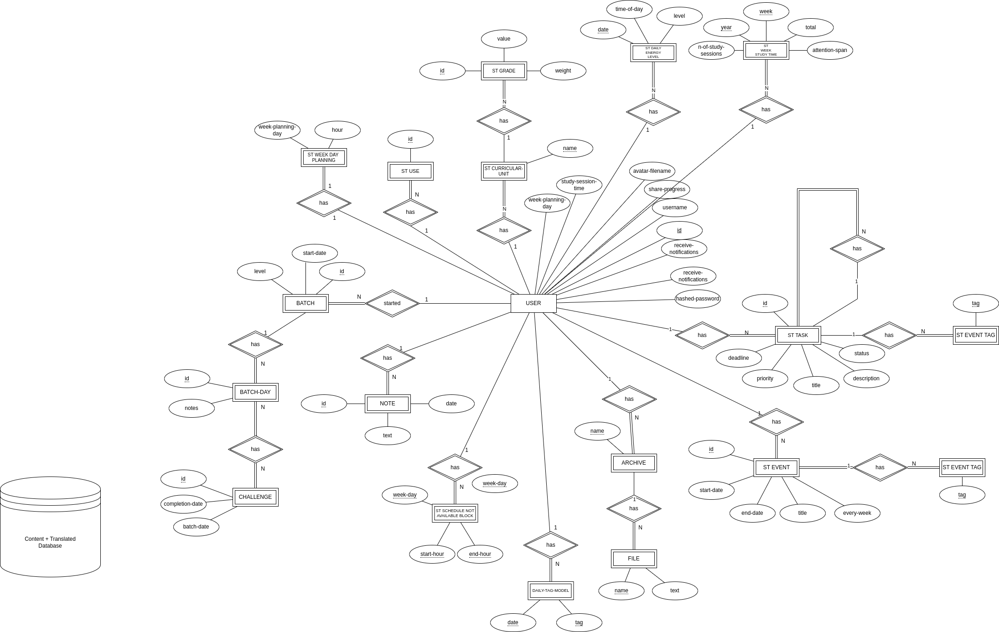

# Backend Notes

## Architecture

The design of the backend can be divided in three main components:

- [Router](src/router);
- [Services](src/service);
- [Repository](src/repository).

### Router

Uses the [FastAPI](https://fastapi.tiangolo.com/) library, to build a web server.

This component handles external HTTP(s) requests, converts data structures between input/output DTOs and domain. It's also resposible to catch any existent raised exceptions, converting them to the appropriated error codes.

[main.py](src/main.py) specifies the router configuration, plus the exception conversion to the respective error reply messages.

### Services

Manage domain logic, for instance validations, and interacting one or multiple times with the DB to retreive or/and persisit data.

### Repository

Responsible for all the interaction with the external or internal database.
Duo to time constraints, at the moment of writing, the internal repository implementation is quite incomplete.

On the other expectrum, the SQL implementation uses the [SQL Model](https://sqlmodel.tiangolo.com/) library, to interact with the external DB implementation. For separtion of concerns, this component abstracts all the logic and data structures required for the interaction with the database. In particular, the [models.py](src/repository/sql/models/models.py) contain all the model classes that represent tables in the external [Postgres SQL](https://www.postgresql.org/) database.\
When the backend runs, one of the first things it does, is to create the tables, if not created already, given by the [models.py](src/repository/sql/models/models.py) component.

Inside each of these three components, three more components exist:

- Commons;
- Acedemic Challenge;
- Study Tracker.

As the names imply, both the `Acedemic Challenge` and the `Study Tracker` corresponds to components from each of the frontend applications. The `Commons` handles operations that support both applications, such as user creation, log-in, etc.

To ease the reading of the model, the following diagram displays a ERM representation: .\
The source code is also available .

## Program Flow

A typical request is handled by the router. Depending on the request, the router calls the services to full-fill the request, which handle the request logic. When a request, which typically does, requires interaction with storage (external or internal), the service calls the repository component.

## Data Structures

There are three types of data structures in the code base:

- DTOs: [Input](src/router/study_tracker/dtos/input_dtos.py) and [Output](src/router/study_tracker/dtos/output_dtos.py) DTOs;
- [Domain](src/domain);
- [Models](src/repository/sql/models/models.py).

The argument for the separation between the `DTO`'s, and the [Domain](src/domain) classes/data strcutures, is to avoid acidental break-changes in the API, which directly affects client applications that consume it. **If a domain class needs to be changed, it doesn't mean that the DTO will too.**

The classes inside [Models](src/repository/sql/models/models.py) resemble a typical `CREATE_TABLES.slq` file, but written in python, which defines the Postgres SQL tables.

## Migrations

See [migrations](src/migrations).

When subtle changes to the internals of the DB are required, this tool can be used. The tool is called **Alembic**. See more: ["Welcome to Alembic’s documentation!"](https://alembic.sqlalchemy.org/en/latest/).

In short, it's a very simple tool that scans the current state of the database, plus the current state of the [models.py](src/repository/sql/models/models.py) python script, plus, and produces a python script that, once executed, makes the necessary **SQL** changes to match the modified state of the [models.py](src/repository/sql/models/models.py).

## Time Management

In python, duo to the [datetime](https://docs.python.org/3/library/datetime.html) python type, which defines a timestamp as the number of seconds elapsed from **1970**, all requests that require a timestamp, should be made in this format, i.e., as the elapsed number of seconds from 1970.

## Instructions to Run

Before anything, make sure to create a `venv` environmnet, and run:

```bash
$ python3 requirements
```

Check the interactive API documention on: `http://<IP>:<PORT>/docs`.